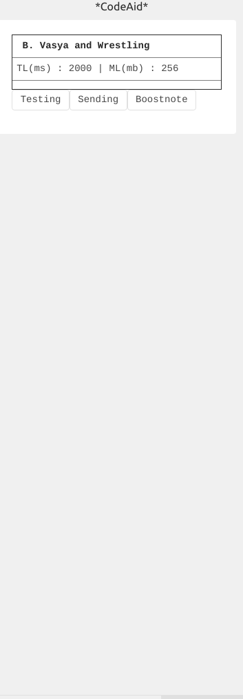
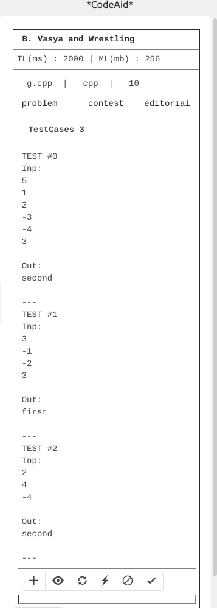
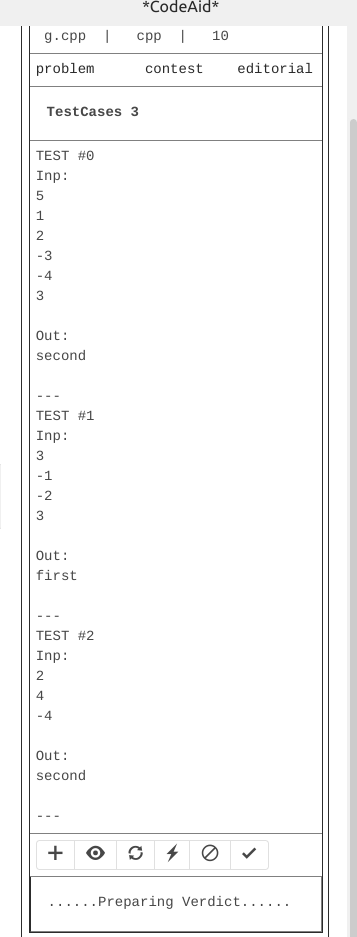

# codeaid
A helper plugin for sports programmers

Integrates with [Competitive Companion](https://chrome.google.com/webstore/detail/competitive-companion/cjnmckjndlpiamhfimnnjmnckgghkjbl)

How to use:
   1. Install this package manually in your atom.
   2. Install Competitive Companion on your browser.
   3. Set up port = 8080 in Competitive Companion settings.
   4. Open package in atom.
   5. Go to any problem. If the Competitive Companion icon is green. Click or ( use shortcut ctrl+shift+u )
   6. Switch to Atom. Your problem will appear.
   7. Write Code. Run code with Test button. See verdict.
   8. Add your test cases. See verdict.
   9. Does not run locally.

Snapshots for [this](http://codeforces.com/contest/493/problem/B) problem!

